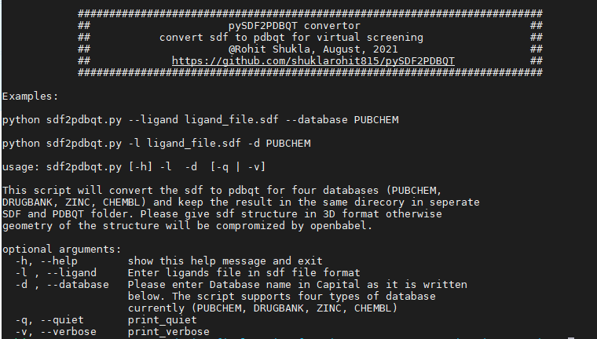

# pySDF2PDBQT
This program will convert the small chemical molecules from sdf to pdbqt for four databases ([PUBCHEM](https://pubchem.ncbi.nlm.nih.gov/), [DRUGBANK](https://go.drugbank.com/), [ZINC](https://zinc.docking.org/), [chEMBL](https://www.ebi.ac.uk/chembl/)).
# Usage:
python3 pySDF2PDBQT.py --help

# What you need
1. pySDF2PDBQT for ligand conversion.
2. [Openbabel](http://openbabel.org/wiki/Main_Page) for file format conversion.

# Usage examples:
You should need the Open Babel installed in your computer. Before using this script please check the babel installation status by using this command ($ babel --help).

Please use the 3D format of the ligands otherwise the ligand geometry will be compromised by the Open Babel.

<h5> For PUBCHEM database: </h5>

$ python3 pySDF2PDBQT.py -l PUBCHEM.sdf -d PUBCHEM

<h5> For DRUGBANK database: </h5>

$ python3 pySDF2PDBQT.py -l Drugbank.sdf -d DRUGBANK

<h5> For ZINC database: </h5>

$ python3 pySDF2PDBQT.py -l ZINC_database.sdf -d ZINC

<h5> For chEMBL database: </h5>

$ python3 pySDF2PDBQT.py -l chEMBL.sdf -d CHEMBL

Please use one database at one time and then the script will create two folder. One will have the SDF ligands and second will have the pdbqt files of the ligands.

